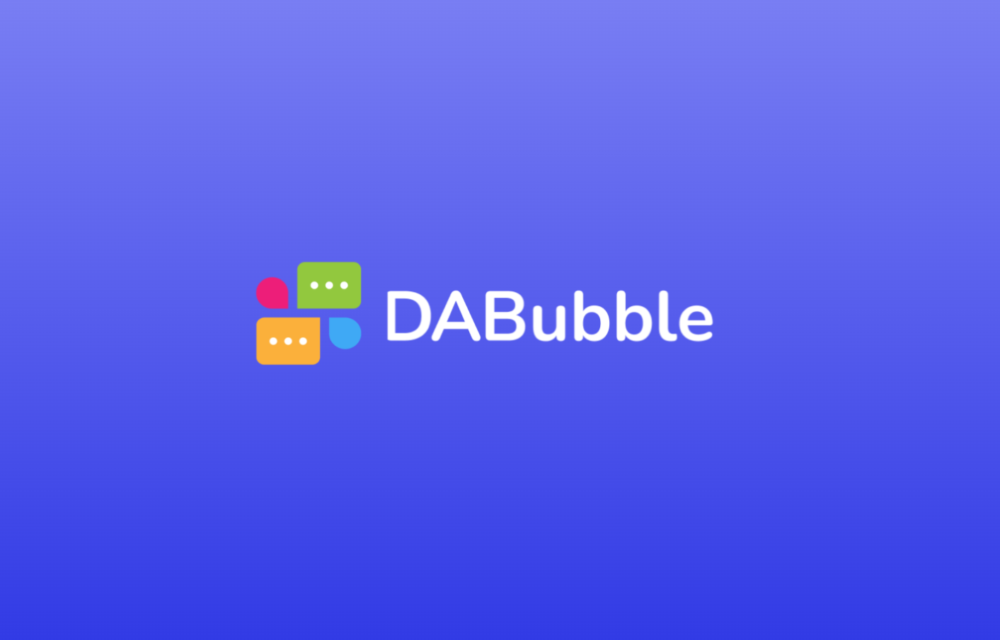
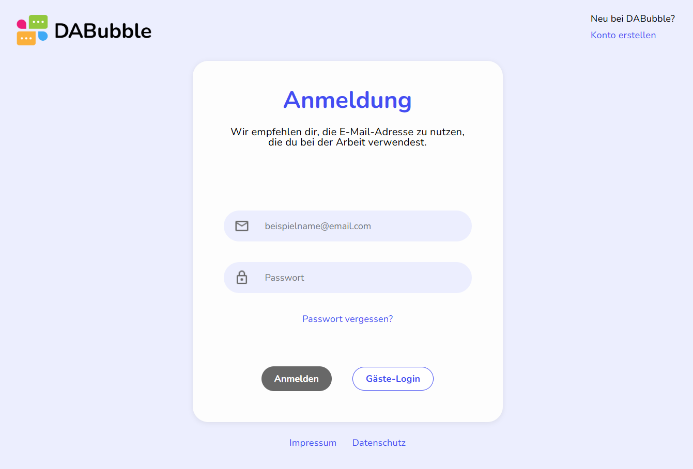
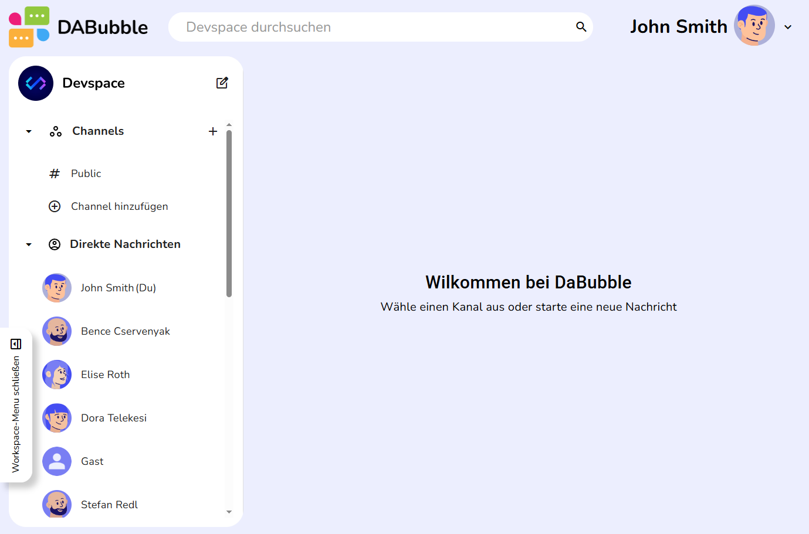
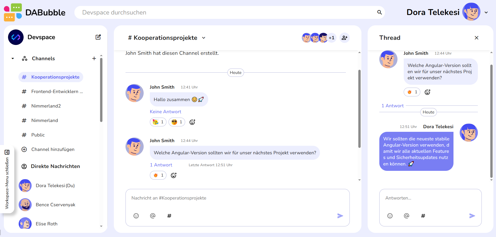
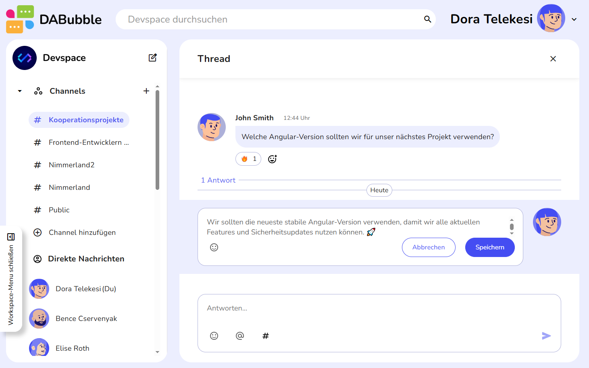
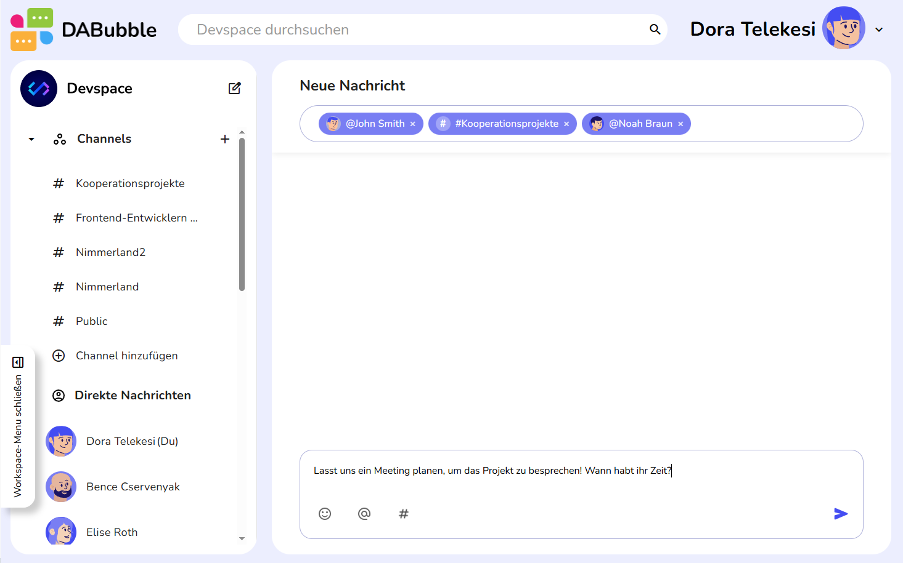
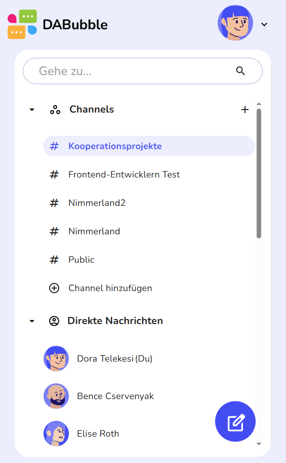
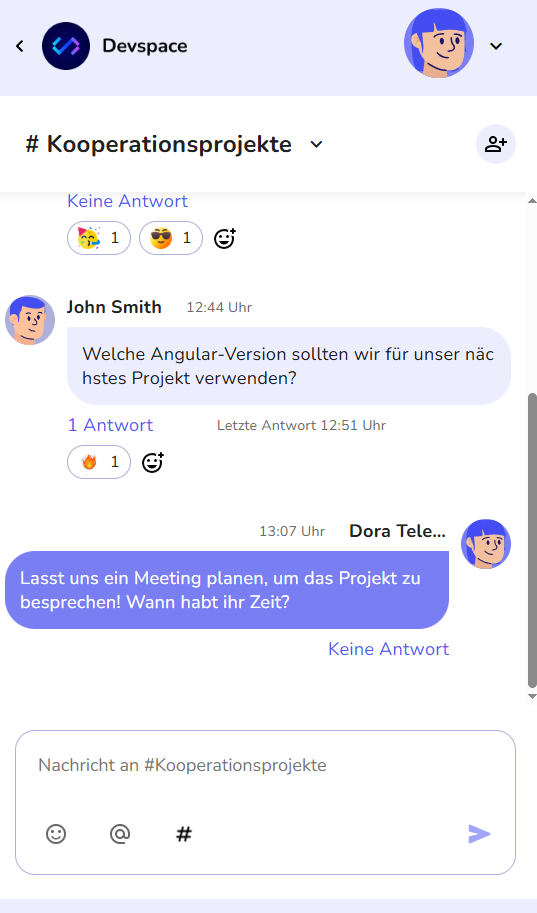

# DABubble — Slack Clone Chat Application 💬✨

A real-time chat messenger application inspired by Slack. Built with Angular 17, Angular Material, TypeScript, SCSS, and Firebase (Cloud Firestore + Authentication).
This project demonstrates a full-featured messaging app with channels, private direct messages, threads, reactions, and advanced user interactions.
Fully responsive design: works on desktop (large screens) and mobile devices. 📱💻

## Live Demo 🌐 
Check out the live application here: [DABubble Live](https://www.dora-telekesi.com/Dabubble/)

## Features 🚀
### 👤 User Authentication

- Register and login with email password & username

- Password reset functionality 

- Login as a guest user 

- Choose a profile image from a set of built-in avatars during registration 

### 💬 Messaging

- Send messages in channels and private DMs

- Messages support threads for deeper discussions 

- Edit your own messages ️

- Add emoji reactions to messages (last 2 reactions always visible)

- Mention users and channels inside messages to create clickable links 

- “New message” functionality: send one message to multiple channels or users at once

### 📢 Channels

- Create channels and invite users 

- Leave channels 

- Edit channel name and description 

### 🧑‍💻 Profile & User Interaction

- Change profile name and profile image via profile menu

- View other users’ profiles by clicking on their names in private messages 

### 🔍 Search

- Search for keywords in messages and threads

- Click search results to navigate directly to the relevant message

### 📱 Responsive Design

- Large screens: full-screen layout with toggleable navigation bar and thread messages visible alongside main messages

- Mobile screens: switch between navigation bar, messages, and threads for a touch-friendly interface

## Tech Stack 🛠️ 

- Angular 17

- Angular Material

- TypeScript

- SCSS

- Firebase Cloud Firestore

- Firebase Authentication

## Screenshots 📸












## Getting Started ⚡ 
1. Clone the project - bash:
```
git clone https://github.com/DoraTelekesi/DABubble.git
cd DABubble
```
2. Install dependencies:
```
npm install
```
3. Run the project:
```
ng serve
```


## Future Improvements 🔮

- Login with Google 

- Show online/offline status of users 

- Notifications for new messages 

- File sharing inside channels and DMs 

- Dark mode theme 
- Switch language (English ↔ German) 


## License 📄

MIT License 
